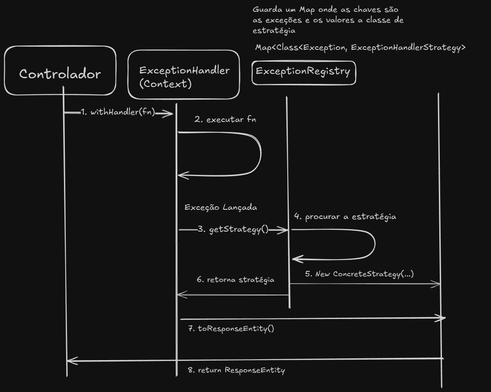

# Padrão Strategy - Sistema de Tratamento de Exceções

## Visão Geral

Este documento descreve a implementação do padrão **Strategy** no sistema de tratamento de exceções, baseado no livro "Design Patterns: Elements of Reusable Object-Oriented Software" de Erich Gamma, Richard Helm, Ralph Johnson e John Vlissides (Gang of Four).

## Estrutura do Padrão Strategy (GoF)

Segundo o GoF, o padrão Strategy é composto por:

1. **Strategy** (interface) - Define uma interface comum para todos os algoritmos
2. **ConcreteStrategy** - Implementa o algoritmo usando a interface Strategy
3. **Context** - Mantém uma referência para um objeto Strategy e delega a ele

---

## Diagrama UML - Estrutura Completa



---

## Mapeamento para o Padrão GoF

### 1. **Strategy** (Interface/Contrato)

**Classe:** `ExceptionHandlerStrategy` (interface)

- Define a interface comum para todas as estratégias de tratamento de exceções
- Declara métodos que todas as concrete strategies devem implementar

### 2. **ConcreteStrategy** (Implementação Concreta)

**Classe:** `GenericExceptionHandlerStrategy` (class)

- Implementa o algoritmo de tratamento de exceção genérico
- Converte exceções em `ResponseEntity` HTTP
- Pode ser estendido com outras estratégias específicas no futuro

### 3. **Context** (Contexto de Uso)

**Classe:** `ExceptionHandler` (class)

- Mantém referência ao registry que fornece as strategies
- Delega o tratamento de exceções para a strategy apropriada
- Método `withHandler()` executa operações com tratamento automático

### 4. **Componentes Auxiliares**

#### **ExceptionRegistry** (Factory/Registry Pattern)
- Responsável por criar e fornecer a strategy apropriada
- Usa padrão Factory para instanciar strategies
- Mantém mapeamento de Exception → Strategy

#### **ExceptionEntry** (Value Object)
- Encapsula metadados de cada exceção registrada
- Associa tipo de exceção com sua strategy e HTTP status

---

## Diagrama de Sequência - Fluxo de Execução


---

## Benefícios do Padrão Strategy Nesta Implementação

### 1. **Open/Closed Principle**
- Aberto para extensão: Novas strategies podem ser adicionadas sem modificar código existente
- Fechado para modificação: O Context (`ExceptionHandler`) não precisa ser alterado

### 2. **Single Responsibility**
- Cada strategy é responsável por um tipo específico de tratamento
- ExceptionRegistry gerencia o mapeamento
- ExceptionHandler coordena o fluxo

### 3. **Flexibilidade**
- Diferentes exceções podem ter diferentes estratégias de tratamento
- HTTP status codes podem variar por tipo de exceção
- Fácil adicionar novos tipos de exceção

### 4. **Testabilidade**
- Strategies podem ser testadas isoladamente
- Mock strategies podem ser injetadas para testes
- Context pode ser testado independentemente

---

## Exemplo de Uso

```java
@RestController
public class ProdutoControlador {
    
    private final ExceptionHandler exceptionHandler;
    
    // ...
    
    @GetMapping("/{id}")
    public ResponseEntity<ProdutoResponse> buscarPorId(@PathVariable Long id) {
        return exceptionHandler.withHandler(() -> {
            // Lógica que pode lançar exceções
            Produto produto = produtoServico.buscarPorId(new ProdutoId(id));
            return ResponseEntity.ok(mapeador.toResponse(produto));
        });
    }
}
```

### Fluxo:
1. Controller chama `withHandler()` passando uma lambda
2. ExceptionHandler executa a lambda dentro de try-catch
3. Se exceção ocorrer:
   - ExceptionHandler pede ao Registry a strategy apropriada
   - Registry cria `GenericExceptionHandlerStrategy` com status HTTP adequado
   - Strategy converte exceção em `ResponseEntity<Map<String, String>>`
4. Response é retornado ao cliente

---

## Extensibilidade Futura

### Adicionar Nova ConcreteStrategy

```java
public class ValidationExceptionHandlerStrategy implements ExceptionHandlerStrategy {
    private final ValidationException exception;
    private final HttpStatus status;
    
    public ValidationExceptionHandlerStrategy(ValidationException ex) {
        this.exception = ex;
        this.status = HttpStatus.UNPROCESSABLE_ENTITY;
    }
    
    @Override
    public ResponseEntity<Map<String, String>> toResponseEntity() {
        Map<String, String> body = new HashMap<>();
        body.put("name", "ValidationError");
        body.put("message", exception.getMessage());
        body.put("field", exception.getFieldName());
        body.put("invalidValue", exception.getInvalidValue());
        body.put("statusCode", "422");
        body.put("timestamp", ZonedDateTime.now().toString());
        return ResponseEntity.status(status).body(body);
    }
    
    // ... outros métodos
}
```

### Registrar Nova Strategy

```java
@Component
public class ExceptionRegistry {
    
    public void configureDefaults() {
        // Registros existentes...
        
        // Nova strategy específica
        register(ValidationException.class, 
                 ValidationExceptionHandlerStrategy.class, 
                 HttpStatus.UNPROCESSABLE_ENTITY);
    }
}
```

---

## Comparação com o Padrão GoF Original

| Componente GoF | Implementação | Responsabilidade |
|----------------|---------------|------------------|
| **Strategy** (interface) | `ExceptionHandlerStrategy` | Define contrato para tratamento |
| **ConcreteStrategy** | `GenericExceptionHandlerStrategy` | Implementa tratamento genérico |
| **Context** | `ExceptionHandler` | Coordena execução e delegação |
| **Cliente** | Controllers | Usa o Context para tratar erros |
| **(Extra) Factory** | `ExceptionRegistry` | Cria strategies apropriadas |

---

## Conclusão

A implementação segue fielmente o padrão **Strategy** do GoF, com adições de padrões complementares:

- **Strategy**: Para algoritmos intercambiáveis de tratamento
- **Factory**: Para criação de strategies (ExceptionRegistry)
- **Registry**: Para mapeamento de exceções
- **Value Object**: Para encapsular metadados (ExceptionEntry)

Esta arquitetura permite:
- ✅ Adicionar novos tipos de exceção sem alterar código existente
- ✅ Diferentes estratégias de serialização por tipo de erro
- ✅ Mapeamento flexível de HTTP status codes
- ✅ Código limpo, testável e manutenível
